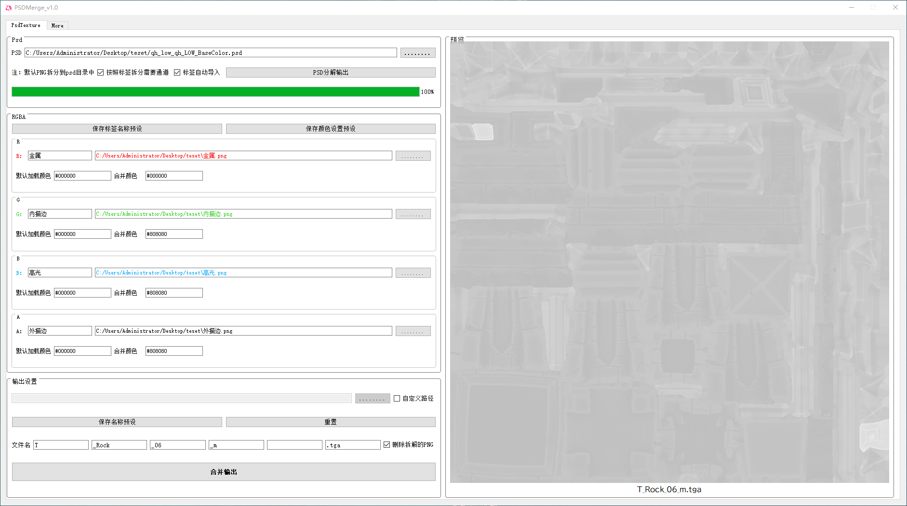

# PSDMerge
桌面应用-PSD图层文件分析通道打包工具PSDMerge，基于Python3.8 + Pyside2 + QTdesigner
## 工具介绍
一款独立于PS的软件，解决项目中贴图制作中的流程问题 
## 主要功能
- 支持PSD图层解析  
- 支持自定义标签匹配与保存预设  
- 支持自定义导入
- 支持自定义单个通道默认背景层（未使用时），和自定义合并层，解决图层PNG为透明需求
- 支持自定义导出路径（默认是psd路径）
- 支持输入自动打开文件路径
## 界面

输出

## 逻辑
